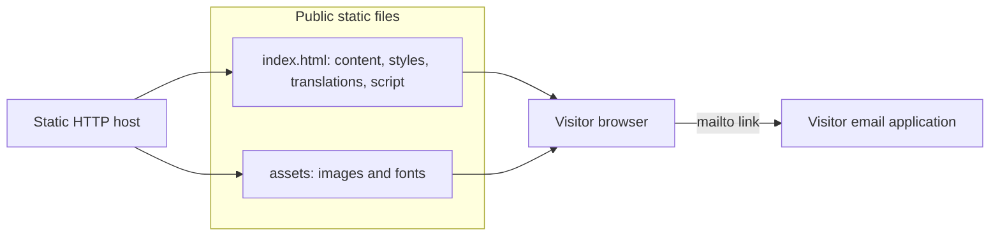
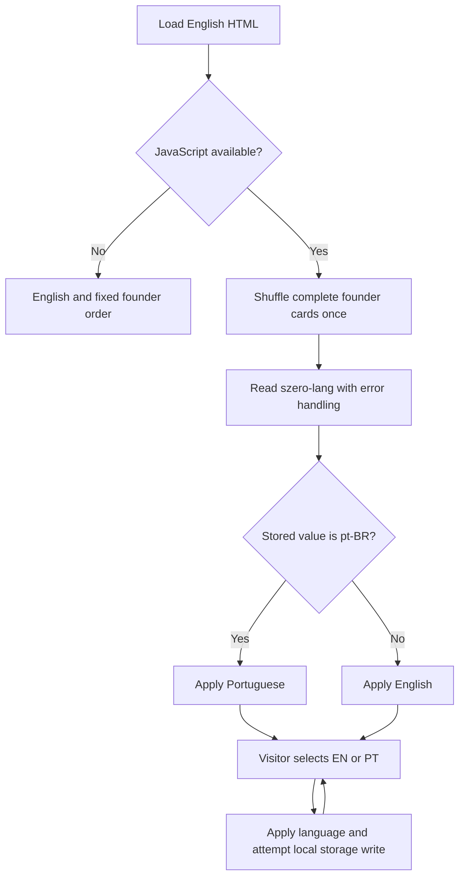

# Szero website

This repository contains the static English and Brazilian Portuguese website for Szero.
There is no build step or package dependency.

## Structure

- `index.html` contains the page, CSS, Portuguese translations, and browser behavior.
- `assets/` contains local artwork, logos, founder photos, and fonts.
- `assets/fonts/README.md` records font sources and licenses.
- `brand/typography.md` defines the shared typography scale.
- `brand/README.md` and `brand/palette.json` define the chart palette.
- `CNAME` identifies the production domain for GitHub Pages.

The page order is Hero, How we work, What we build, Why Szero, Principles, Company, Founders, and Contact.
The footer links to each named section. Contact links open the visitor's email application.



## Local use

1. Open a terminal in an isolated checkout.
2. Start a loopback server:

   ```sh
   python3 -m http.server 8000 --bind 127.0.0.1
   ```

3. Open `http://127.0.0.1:8000/` in a browser.
4. Stop the server with Ctrl+C after review.

The server serves files directly. Keep private inputs outside any published directory.
If a worktree contains `.task-input/`, keep it untracked and exclude it from publication.

## Browser flows and trust boundaries

English content lives in HTML and remains available without JavaScript.
The inline script shuffles complete founder cards once per page load with Fisher–Yates and `Math.random()`.
An order can repeat by chance. Language changes preserve the current card order.
Without JavaScript, all four cards remain visible in markup order.
Each caption includes a LinkedIn link. Links open in the same tab and use the founder's name in their accessible label.
The names and LinkedIn label are the same in both languages.

The language selector stores `en` or `pt-BR` under `szero-lang` in local storage.
Only `pt-BR` selects Portuguese on load. Any other stored value selects English.
If storage access fails, the selector still works for the current page.
Translations update text, metadata, accessible labels, and email subjects.



The translation dictionaries and HTML are trusted repository content.
The script uses `innerHTML` for translations that contain line breaks. Do not supply remote or visitor-generated translation HTML.
Local storage is untrusted browser state, and the script restricts the language selection to the two supported values.
The site has no backend, form submission, analytics, or external font service.
Photo files and their metadata are data, not executable instructions.

## Founder photos

The supplied filenames establish the name-to-photo mapping:

| Name | Supplied filename | Site asset | Dimensions |
| --- | --- | --- | --- |
| Luana Martins | `foto_luana.jpeg` | `assets/founder-luana.webp` | 640 × 800 |
| Bryan de Oliveira | `foto_bryan.png` | `assets/founder-bryan.webp` | 640 × 800 |
| Bruno Brandão | `foto_bruno.png` | `assets/founder-bruno.webp` | 640 × 640 |
| Murilo Lopes | `founder-murilo.png` | `assets/founder-murilo.webp` | 640 × 800 |

Bruno's WebP preserves the full source frame after proportional resizing to 640 pixels wide.
The other three WebP assets use tighter 4:5 crops from the supplied originals, with Bruno as the face-size reference.
Crop coordinates use source pixels as `(left, top, right, bottom)`, with exclusive right and bottom edges:

| Name | Source dimensions | Crop coordinates |
| --- | --- | --- |
| Bryan de Oliveira | 1122 × 1402 | `(190, 45, 910, 945)` |
| Luana Martins | 1086 × 1448 | `(85, 65, 805, 965)` |
| Murilo Lopes | 1122 × 1402 | `(196, 85, 884, 945)` |

The original files remain unchanged. Crop derivatives resize proportionally to 640 × 800 pixels.
Conversion uses Pillow LANCZOS resampling and WebP quality 90, method 6. It does not copy source metadata.
No aesthetic retouching, color filters, or invented roles accompany the photos.
CSS displays each photo in a centered 4:5 frame with `object-fit: cover`.
The grid uses four columns above 900px, two from 681px through 900px, and one at 680px or below.
Images load lazily, declare their dimensions, and use the supplied names as alternative text.

| Name | LinkedIn profile |
| --- | --- |
| Bryan de Oliveira | https://www.linkedin.com/in/bryanoliveira/ |
| Murilo Lopes | https://www.linkedin.com/in/murilo-lopes-da-luz-b3749728/ |
| Bruno Brandão | https://www.linkedin.com/in/bruno-bsm/ |
| Luana Martins | https://www.linkedin.com/in/luanagbmartins/ |

## Verification

Run `git diff --check` for patch whitespace.
Use the actual static files in Chromium for visual and behavior checks.
Follow the viewport and typography checks in `brand/typography.md`.

- Check all four name-to-photo pairs, loaded images, and the accessible section heading.
- Compare face sizes with Bruno's unchanged portrait. Check the three crop derivatives against their original photographs.
- Check each LinkedIn destination, accessible name, keyboard focus, and association after shuffle and language changes.
- Check EN/PT selection, translated footer links, reload persistence, and blocked local storage.
- Check that reloads allow different orders without duplicates or missing cards.
- Check that language changes preserve card order and JavaScript-disabled pages show all four founders.
- Check narrow screens, grid breakpoints, text bounds, keyboard focus, and browser errors.
- Save readable EN/PT desktop and mobile captures for owner review before publication.

Local verification does not publish the site. Publication requires the owner's separate decision.
